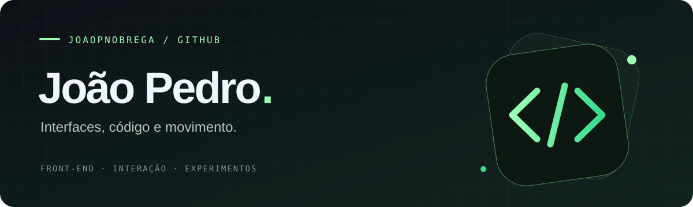

  

  <b>Interfaces com personalidade. Código que dá vida às ideias.</b> 
  Exploro desenvolvimento web, animação e experiências interativas.

  <a href="https://jpnobrega.me">Conheça meu portfólio ↗</a>

---

### Oi, eu sou João Pedro 👋

Por aqui você encontra experimentos de front-end, efeitos de interface e projetos interativos. Gosto de explorar o encontro entre o visual e o código — de uma animação sutil a uma experiência em 3D.

### Tecnologias que aparecem nos meus projetos

  
  
  
  
  
  

### Meu portfólio

[**jpnobrega.me ↗**](https://jpnobrega.me)

 

  Design, experimentação e movimento · <a href="https://github.com/JoaoPNobrega">@JoaoPNobrega</a>

